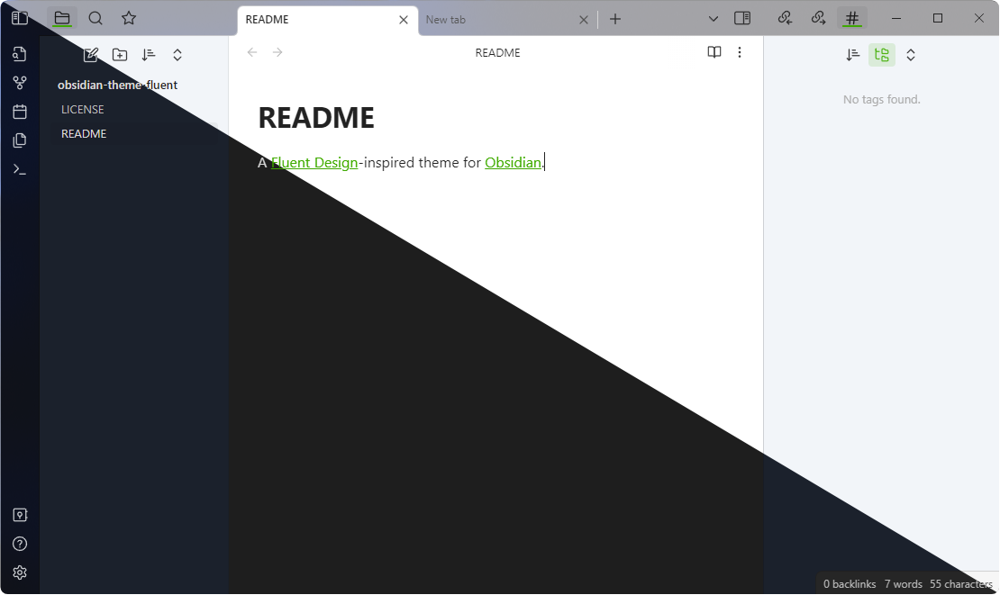
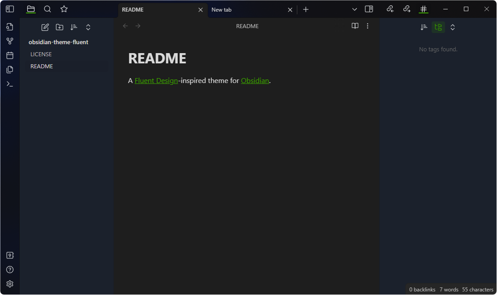
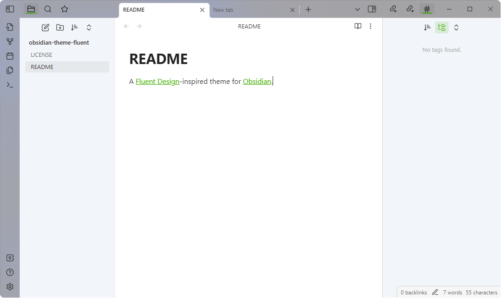

# Fluent for Obsidian
An [Obsidian](https://obsidian.md/) theme for a modern Windows 11 system.

## Features

- Designed to look at home on Windows 11.
- Supports window transparency.
- Supports hidden, obsidian, and native frame styles.
- Replaces the Obsidian window buttons with Windows 11 ones.

## Screenshots

| Dark Mode                                                    | Light Mode                                                   |
| ------------------------------------------------------------ | ------------------------------------------------------------ |
|  |  |

## Installation

Download this repo and extract it into your Obsidian themes folder as "Fluent"!
